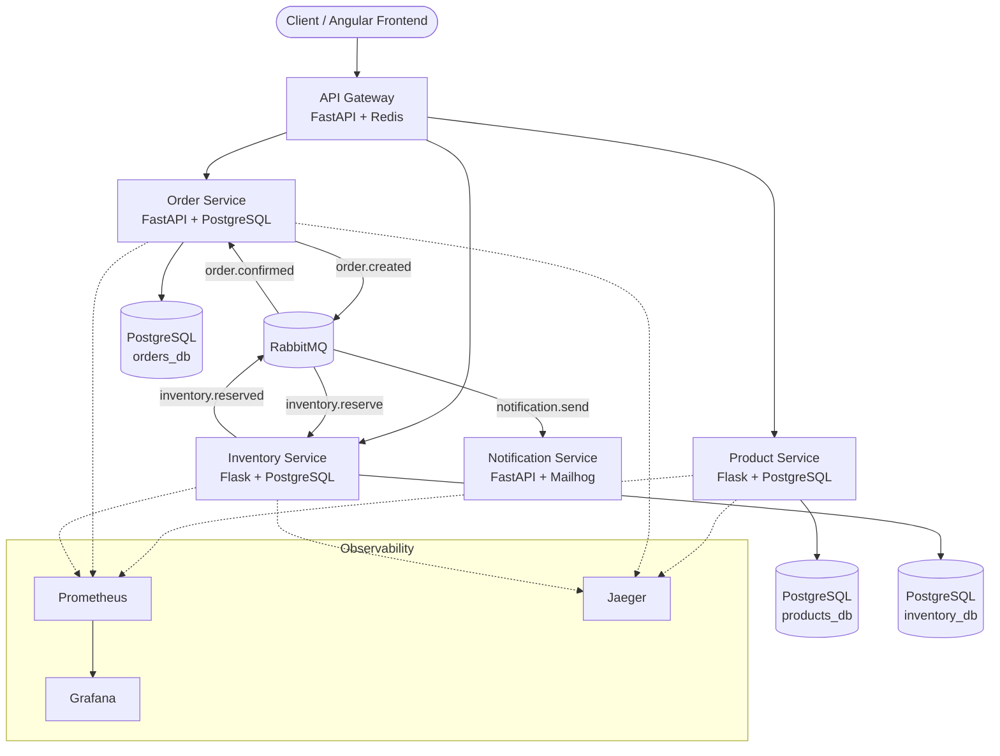

# NexuShop - Self-Healing Microservices E-Commerce Platform

A production-grade, event-driven e-commerce backend demonstrating microservices architecture, self-healing patterns, and full observability -- built with Python, Docker Compose, and CI/CD.

## Architecture



## Tech Stack

| Layer | Technology | Purpose |
|---|---|---|
| API Gateway | FastAPI + Redis | Routing, JWT auth, rate limiting |
| Product Service | Flask + PostgreSQL | Product catalog CRUD |
| Order Service | FastAPI + PostgreSQL | Order lifecycle, saga pattern |
| Inventory Service | Flask + PostgreSQL | Stock management |
| Notification Service | FastAPI | Event-driven email notifications |
| Messaging | RabbitMQ | Async event bus with dead letter queues |
| Caching | Redis | Rate limiting, response caching |
| Monitoring | Prometheus + Grafana | Metrics and dashboards |
| Tracing | OpenTelemetry + Jaeger | Distributed request tracing |
| CI/CD | GitHub Actions | Lint, test, build, integration tests |
| Load Testing | Locust | Performance benchmarking |

## Self-Healing Patterns

- **Circuit Breakers** (pybreaker) -- open after 5 failures, auto-reset after 30s
- **Retry with Exponential Backoff** (tenacity) -- transient failure recovery
- **Health Checks** -- `/health` and `/ready` endpoints on every service
- **Docker Healthchecks** -- automatic container restart on failure
- **Dead Letter Queues** -- failed messages captured for inspection
- **Graceful Degradation** -- cached responses when downstream services are unavailable

## Quick Start

### Prerequisites

- Docker and Docker Compose
- Make (optional, for convenience commands)

### Run

```bash
# Start all services
make up
# or: docker compose up -d --build

# Check service health
make health

# View logs
make logs

# Seed sample products
make seed

# Run tests
make test

# Stop everything
make down

# Full cleanup (removes volumes)
make clean
```

### Service Endpoints

| Service | URL | Description |
|---|---|---|
| Product Service | http://localhost:8001 | Product CRUD API |
| RabbitMQ Management | http://localhost:15672 | Message broker UI (guest/guest) |

### API Examples

```bash
# List products
curl http://localhost:8001/products

# Create a product
curl -X POST http://localhost:8001/products \
  -H "Content-Type: application/json" \
  -d '{"name": "Keyboard", "price": 49.99, "category": "Electronics"}'

# Get a product
curl http://localhost:8001/products/{id}

# Search products
curl "http://localhost:8001/products?search=keyboard&category=Electronics"

# Health check
curl http://localhost:8001/health
curl http://localhost:8001/ready
```

## Project Structure

```
.
├── docker-compose.yml          # Full stack orchestration
├── Makefile                    # Developer convenience commands
├── shared/                     # Shared libraries across services
│   ├── messaging.py            # RabbitMQ connection + helpers
│   ├── health.py               # Health check blueprint
│   ├── circuit_breaker.py      # Circuit breaker wrapper
│   └── logging_config.py       # Structured JSON logging
├── product-service/            # Product catalog microservice
│   ├── Dockerfile
│   ├── app/
│   │   ├── main.py             # Flask app factory
│   │   ├── models.py           # SQLAlchemy models
│   │   ├── routes.py           # REST endpoints
│   │   ├── repository.py       # Data access layer
│   │   └── config.py           # Configuration
│   └── tests/                  # pytest suite
├── scripts/
│   ├── init-databases.sql      # Creates per-service databases
│   └── seed_data.py            # Sample product data
└── .github/workflows/          # CI/CD pipelines (Phase 6)
```

## Development Roadmap

- [x] Phase 1: Foundation (infrastructure + Product Service)
- [ ] Phase 2: Core Services (Order + Inventory + event-driven flow)
- [ ] Phase 3: API Gateway + Self-Healing patterns
- [ ] Phase 4: Observability (Prometheus, Grafana, Jaeger)
- [ ] Phase 5: Angular Frontend
- [ ] Phase 6: CI/CD + Load Testing + Polish
